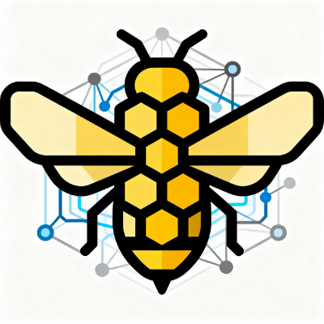

<a id="readme-top"></a>

<!-- PROJECT SHIELDS -->
[![Go Version][go-version-shield]][go-version-url]
[![License][license-shield]][license-url]

<br />
<div align="center">
  <a href="https://github.com/apiarycd/apiarycd">
    
  </a>

<h3 align="center">ApiaryCD</h3>

  <p align="center">
    GitOps-style API for managing Docker Swarm stacks from Git repositories.
    <br />
    <br />
    <a href="./requests.http">View Request Examples</a>
    ·
    <a href="https://github.com/apiarycd/apiarycd/issues">Report Bug</a>
    ·
    <a href="https://github.com/apiarycd/apiarycd/issues">Request Feature</a>
  </p>
</div>

<!-- TABLE OF CONTENTS -->
- [About The Project](#about-the-project)
  - [Built With](#built-with)
- [Getting Started](#getting-started)
  - [Prerequisites](#prerequisites)
  - [Installation](#installation)
- [Usage](#usage)
- [API Overview](#api-overview)
- [Configuration](#configuration)
- [Development](#development)
- [Roadmap](#roadmap)
- [Contributing](#contributing)
- [License](#license)
- [Contact](#contact)
- [Acknowledgments](#acknowledgments)


<!-- ABOUT THE PROJECT -->
## About The Project

> Project is currently in development.

ApiaryCD is a Go service that lets you register Git repositories as Docker Swarm stacks, deploy them, track deployment history, and roll back when needed.

Core capabilities include:

* Stack lifecycle management (`create`, `list`, `get`, `update`, `delete`)
* Git repository synchronization (`clone`/`pull`) per stack
* Deployment operations (`deploy`, `history`, `rollback`)
* OpenAPI/Swagger docs and health endpoints
* Metrics and structured logging

<p align="right">(<a href="#readme-top">back to top</a>)</p>

### Built With

* [![Go][Go.dev]][Go-url]
* [![Fiber][Fiber.dev]][Fiber-url]
* [![Fx][Fx.dev]][Fx-url]
* [![Badger][Badger.dev]][Badger-url]
* [![Docker][Docker.com]][Docker-url]

<p align="right">(<a href="#readme-top">back to top</a>)</p>

<!-- GETTING STARTED -->
## Getting Started

### Prerequisites

You should have these installed locally:

* Go 1.24+
* Docker Engine
* Docker Swarm initialized on your target host (`docker swarm init`)
* `golangci-lint` (for lint/format tasks)
* `swag` (for Swagger generation)

### Installation

1. Clone the repository.
   ```sh
   git clone https://github.com/apiarycd/apiarycd.git
   cd apiarycd
   ```
2. Install dependencies.
   ```sh
   make deps
   ```
3. Copy the example configuration file.
   ```sh
   cp configs/config.example.yml configs/config.yml
   ```
4. Set `CONFIG_PATH` and run the API.
   ```sh
   CONFIG_PATH=./configs/config.yml go run .
   ```

<p align="right">(<a href="#readme-top">back to top</a>)</p>

<!-- USAGE EXAMPLES -->
## Usage

By default, the API listens on `127.0.0.1:3000`.

* Swagger UI: `http://127.0.0.1:3000/api/v1/docs`
* Health endpoints:
  * `GET /health`
  * `GET /health/startup`
  * `GET /health/ready`
  * `GET /health/live`

Example: create a stack.

```sh
curl -X POST http://127.0.0.1:3000/api/v1/stacks \
  -H "Content-Type: application/json" \
  -d '{
    "name": "demo",
    "git_url": "https://github.com/apiarycd/demo-stack",
    "git_branch": "master",
    "compose_path": "compose.yml"
  }'
```

More request samples are available in [`requests.http`](./requests.http).

<p align="right">(<a href="#readme-top">back to top</a>)</p>

## API Overview

Base path: `/api/v1`

Stacks:

* `GET /stacks`
* `POST /stacks`
* `GET /stacks/:id`
* `PATCH /stacks/:id`
* `DELETE /stacks/:id`

Deployments:

* `POST /stacks/:id/deploy`
* `GET /stacks/:id/history`
* `POST /stacks/:id/rollback`

## Configuration

ApiaryCD loads defaults and optionally merges YAML from `CONFIG_PATH`.

Top-level configuration keys:

* `http`
  * `address`
  * `proxy_header`
  * `proxies`
* `storage`
  * `data_dir`
* `docker`
  * `host`
  * `api_version`
  * `timeout`
  * `tls_enabled`
  * `ca_file`
  * `cert_file`
  * `key_file`
* `repositories`
  * `timeout`
  * `storage_dir`
  * `default_auth.ssh.private_key_path`
  * `default_auth.ssh.username`
  * `default_auth.https.username`
  * `default_auth.https.password`
* `deployments`
  * `deploy_timeout`
  * `rotate_immutable_resources`

Start from [`configs/config.example.yml`](./configs/config.example.yml) and tailor values for your Docker/Git environment.

## Development

Useful `make` targets:

* `make fmt` – format code
* `make lint` – run lint checks
* `make test` – run tests with race detector and coverage profile
* `make coverage` – print and export coverage reports
* `make swagger` – regenerate OpenAPI docs
* `make build` – build binary to `bin/`
* `make help` – list targets

## Roadmap

- [ ] Add repository webhooks for automatic deployments
- [ ] Add RBAC and authn/authz middleware
- [ ] Add multi-environment promotion workflows
- [ ] Add deployment diff previews

See the [open issues](https://github.com/apiarycd/apiarycd/issues) for a full list of proposed features and known issues.

<p align="right">(<a href="#readme-top">back to top</a>)</p>

## Contributing

Contributions are what make the open source community such an amazing place to learn, inspire, and create. Any contributions you make are **greatly appreciated**.

If you have a suggestion that would make this better, please fork the repo and create a pull request. You can also simply open an issue with the tag "enhancement".

1. Fork the Project
2. Create your Feature Branch (`git checkout -b feature/AmazingFeature`)
3. Commit your Changes (`git commit -m 'Add some AmazingFeature'`)
4. Push to the Branch (`git push origin feature/AmazingFeature`)
5. Open a Pull Request

## License

Distributed under the Apache 2.0 License. See [`LICENSE`](./LICENSE) for more information.

## Contact

Project Link: [https://github.com/apiarycd/apiarycd](https://github.com/apiarycd/apiarycd)

## Acknowledgments

* [Best-README-Template](https://github.com/othneildrew/Best-README-Template)
* [go-core-fx](https://github.com/go-core-fx)
* [Docker Swarm](https://docs.docker.com/engine/swarm/)

<p align="right">(<a href="#readme-top">back to top</a>)</p>

<!-- MARKDOWN LINKS & IMAGES -->
[go-version-shield]: https://img.shields.io/badge/go-1.24%2B-00ADD8?style=for-the-badge&logo=go&logoColor=white
[go-version-url]: https://go.dev/
[license-shield]: https://img.shields.io/badge/license-Apache%202.0-blue.svg?style=for-the-badge
[license-url]: ./LICENSE

[Go.dev]: https://img.shields.io/badge/Go-00ADD8?style=for-the-badge&logo=go&logoColor=white
[Go-url]: https://go.dev/
[Fiber.dev]: https://img.shields.io/badge/Fiber-00B894?style=for-the-badge
[Fiber-url]: https://gofiber.io/
[Fx.dev]: https://img.shields.io/badge/Uber%20Fx-2E2E2E?style=for-the-badge
[Fx-url]: https://uber-go.github.io/fx/
[Badger.dev]: https://img.shields.io/badge/BadgerDB-6A1B9A?style=for-the-badge
[Badger-url]: https://github.com/dgraph-io/badger
[Docker.com]: https://img.shields.io/badge/Docker-2496ED?style=for-the-badge&logo=docker&logoColor=white
[Docker-url]: https://www.docker.com/
